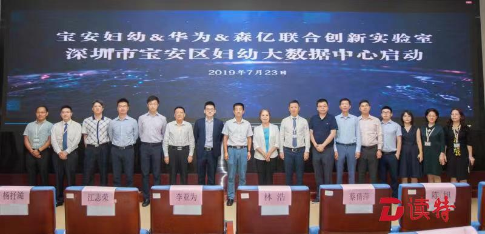

<!--
 * @Author: your name
 * @Date: 2020-03-20 11:10:09
 * @LastEditTime: 2020-03-20 12:35:20
 * @LastEditors: Please set LastEditors
 * @Description: In User Settings Edit
 * @FilePath: \Learing\web\huaqyun\docs\zh-cn\about.md
 -->
### 关于我们
2019年7月23日，“深圳市宝安妇幼大数据中心”揭牌仪式在深圳市宝安区妇幼保健院举行。宝安妇幼保健院、华为技术有限公司、上海森亿科技有限公司共同成立创新实验室，建立宝安妇幼大数据中心。  

据了解，宝安妇幼大数据中心将在妇幼保健信息共享、信息互联、信息开发等方面进行广泛合作与研究，将极大提升医疗工作效率和医疗安全，提升老百姓就医体验感与获得感，为临床、保健、科研和教学提供广阔的应用研究技术支持。

宝安区妇幼保健院院长陈旭表示：“得益于信息化的推广应用，宝安妇幼门诊量已经跃居全市第六位，分娩量跃居全市第一位。医院智慧医院体系初步建立，医院实现智慧无感收费，电子病历广泛应用，信息化已经普及到医疗诊疗的方方面面，智慧加人文使宝安妇幼尝到了人工智能的甜头。随着医疗AI的推进和大数据的应用，将对医院的医疗、保健、科研、教学产生极大促进和提升作用。”

华为深圳办解决方案部李亚为部长指出，华为致力于AI的推广应用，在某些疾病的检查方面取得了成功的实际应用案例。医疗AI在辅助医师、缩短时间、提高准确率、提高工作效率方面具有良好的应用前景，将使工作更智能、更便捷、更效率。

“医院已经进入到医疗大数据和人工智能时代，之前的集成平台方案已经难以满足医院的新需求，需要信息集成平台的方案进一步迭代。”森亿智能朱建江副总裁认为，森亿智能基于AI的新一代医院信息平台能够帮助医院打破“信息孤岛”，实现全院数据互联互通，全面提升医院精细化管理与医疗服务水平。