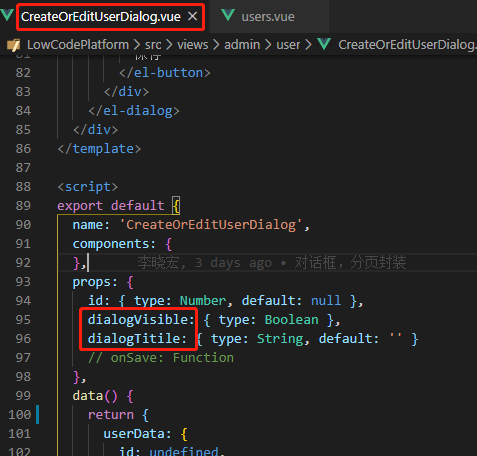
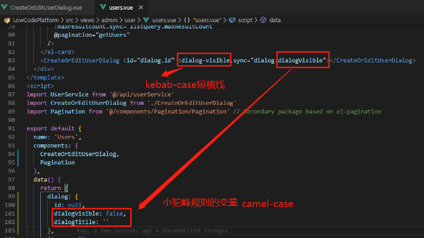

<!--
 * @Author: your name
 * @Date: 2020-03-20 14:45:49
 * @LastEditTime: 2020-03-20 16:41:52
 * @LastEditors: Please set LastEditors
 * @Description: In User Settings Edit
 * @FilePath: \Learing\huaqyun\docs\zh-cn\frontend\standard.md
 -->
### 开发规范
为提高团队协作效率，便于后台人员添加功能及前端后期优化维护输出高质量的文档。为了让大家书写可维护的代码，而不是一次性的代码，让团队当中其他人看你的代码能一目了然，甚至一段时间时候后你再看你某个时候写的代码也能看。
### 1.命名规范
> PascalCase（帕斯卡命名法，大驼峰，首字母大写）举例：CreateOrEditUserDialog.vue  
> Camel-Case （小驼峰，首字母小写）举例：printEmployeePaychecks()  
> kebab-case （短横线）举例：max-result-count  

### 2.规则细则
2.1 普通变量
  * 原则 ：小驼峰命名法
  * 举例：
  ``` javascript
  const userRoles = [];
  const names = new Array();
  ```
  * 说明：语义化，命名必须是跟需求的内容相关的词
  
2.2 常量const
   * 原则：大写字母和下划线
   * 举例：
   ``` javascript
   const MAX_COUNT = 10
   ```
2.3 方法method
   * 原则：小驼峰式命名，统一使用动词或者动词+名词形式
   * 举例：
   ``` javascript
   // 获取用户列表
    async getUsers() {
      this.loading = true
      const { result } = await UserService.getUsers(this.listQuery)
      console.log(result)
      if (result && result.items) {
        this.userList = result.items
        this.totalCount = result.totalCount
        console.log(result.items)
      }
      this.loading = false
    }
   ```
2.3 组件名（重要）
   * 方法：PascalCase大驼峰
   * 举例：
   ```
   命名时：CreateOrEditUserDialog.vue
   导入或者导出时：CreateOrEditUserDialog
   ```
   说明：有意义的名词、具有可读性！不要怕长！
   * 导入 
   ``` javascript
   import CreateOrEditUserDialog from './CreateOrEditUserDialog'
   ```
   * 导出 
   ``` javascript
  <script>
  export default {
  name: 'CreateOrEditUserDialog',
  components: {
  ...
    }
  }
    </script>
   ```
   <font color=#fff68f size=3>使用：特别注意，在VUE中使用组件会自动Camel-Case进行转换,以下两种均可以。</font>
   
   ``` javascript
   <create-or-edit-user-dialog :id="dialog.id" :dialogvisible.sync="dialog.dialogVisible"></create-or-edit-user-dialog>
   ```

   ```
   <CreateOrEditUserDialog :id="dialog.id" :dialogvisible.sync="dialog.dialogVisible"></CreateOrEditUserDialog>
   ```
   <font color=#fff68f size=3>注意：此时，在子组件中访问父组件变量时：</font>
   ```
   this.$emit('update:dialog-visible', false)
   ```
   2.4 views下的文件命名
   * 尽量是名词,且使用大驼峰命名法
   * 只有一个文件的情况下不会出现文件夹，而是直接放在 views 目录下面，如 index.vue
   * 例如：views/admin/user/AdminUsers.vue
   * 注意：如果需要Kepp-Alive，此时注册的组件名称也应当为AdminUsers.vue

   2.5 props 命名

   * 在子组件声明 prop 的时候，其命名应该始终使用 camelCase。在父组件引用该子组件的属性时，模板中应该始终使用 kebab-case。
   * 举例：定义子组件：CreateOrEditUserDialog.vue

       
   
       

2.6 注释规范
>代码注释在一个项目的后期维护中显的尤为重要，所以我们要为每一个被复用的组件编写组件使用说明，为组件中每一个方法编写方法说明务必添加注释列表!!!

* 公共组件使用说明
* 各组件中重要函数或者类说明
* 复杂的业务逻辑处理说明
* 特殊情况的代码处理说明,对于代码中特殊用途的变量、存在临界值、函数中使用的 hack、使用了某* 种算法或思路等需要进行注释描述
* 多重 if 判断语句
* 注释块必须以/ **（至少两个星号）开头**/
* 单行注释使用//

2.6.1 单行注释
 
   ```
   // bad!!
 
  var name =”abc”; // 姓名    
 
  // good
 
  // 姓名
  var name = “abc”;
   ```
2.6.2 多行注释
```
      /**
      * 组件名称
      * @desc 组件描述
      * @author 组件作者
      * @date 2017年12月05日17:22:43
      * @param {Object} [title]    - 参数说明
      * @param {String} [columns] - 参数说明
      * @example 调用示例
      *  <hbTable :title="title" :columns="columns" :tableData="tableData"></hbTable>
      **/
```
**说明：使用插件comment插件或者koroFileHeader**
